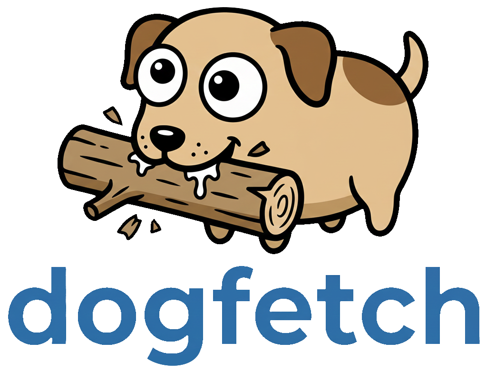

# dogfetch

Getting [Datadog logs](https://docs.datadoghq.com/logs/) to your machine is ruff. If you're a lazy mutt like 
me, use **dogfetch**. Woof!

## Quick start

```bash
export DD_API_KEY=your_api_key
export DD_APP_KEY=your_app_key

dogfetch --query 'service:web status:error' \
  --from '2024-01-01T00:00:00Z' \
  --to '2024-01-02T00:00:00Z' | jq -r '.attributes.message'
```

## Features

- **Simple query interface** - Fetch logs using Datadog's query syntax
- **Flexible output formats** - JSON or NDJSON (newline-delimited JSON)
- **Memory efficient streaming** - NDJSON mode streams results to disk with minimal memory usage
- **Pagination checkpoint/resume** - Save progress and resume from where you left off if interrupted
- **Configurable time ranges** - Query logs from specific time windows
- **Cross-platform** - Works on Linux, macOS, and Windows

## Installation

### Pre-built binaries

Download the latest release for your platform from the [releases page](https://github.com/jtzemp/dogfetch/releases).

### Go install

```bash
go install github.com/jtzemp/dogfetch@latest
```

### Build from source

```bash
git clone https://github.com/jtzemp/dogfetch
cd dogfetch

# Simple build
go build -o dogfetch

# Or use make for versioned build
make build
```

### Building with Version Information

The Makefile automatically injects version information from git:

```bash
# Build with version info
make build

# Check version
./dogfetch --version

# Build for all platforms
make build-all
```

## Prerequisites

You need a [Datadog API key and Application key](https://docs.datadoghq.com/account_management/api-app-keys/).
Set them as environment variables:

```bash
export DD_API_KEY=your_api_key
export DD_APP_KEY=your_app_key
```

Optionally, set your Datadog site if not using the default (datadoghq.com):

```bash
export DD_SITE=datadoghq.eu
```

## Usage

### Basic Usage

```bash
# Fetch logs matching a query (outputs to stdout)
dogfetch --query 'service:web status:error'

# Pipe to a file
dogfetch --query 'service:web status:error' > logs.ndjson

# Or save directly to a file
dogfetch --query 'service:web status:error' --output logs.ndjson

# Specify a custom time range
dogfetch --query 'service:api' --from '2024-01-01T00:00:00Z' --to '2024-01-02T00:00:00Z'

# Use JSON format and save to file
dogfetch --query 'service:database' --format json --output db-logs.json
```

### Command Line Options

```
--query string
    The filter query (search term). Single quote the entire query for best results.
    Example: --query 'service:web status:error'

--index string
    Which index to read from (default "main")

--from string
    Start date/time (default: 24 hours ago)
    Formats: RFC3339 (2024-01-01T00:00:00Z), Unix timestamp (1704067200)

--to string
    End date/time (default: current time)
    Formats: RFC3339 (2024-01-01T00:00:00Z), Unix timestamp (1704067200)

--pageSize int
    How many results to download at a time (default: 1000, max: 5000)

--output string
    Path of file to write results to (default: stdout)
    When not specified, logs are written to stdout and progress to stderr

--format string
    Output format: "json" or "ndjson" (default "ndjson")

    json   - Single JSON array, all data loaded into memory
    ndjson - Newline-delimited JSON, streams as it fetches (low memory)

--cursor string
    Page cursor position for resuming from a specific point
    Only works with streamable formats (ndjson)

--append
    Append to output file instead of overwriting
    Only works with streamable formats (ndjson)

--errors-out string
    Write progress and error messages to file (default: stderr)
```

### Advanced Usage

#### Streaming Large Datasets

NDJSON format (the default) streams results as they're fetched, minimizing memory usage:

```bash
dogfetch --query 'service:api' \
  --output large-export.ndjson \
  --pageSize 5000

# Or pipe directly to another tool
dogfetch --query 'service:api' | jq -r '.attributes.message'
```

#### Resume After Interruption

If a large fetch is interrupted, you can resume from where it left off. The cursor value is printed to stderr 
when the fetch stops:

```bash
# First attempt (gets interrupted)
dogfetch --query 'service:web' --output logs.ndjson
# stderr: Fetched 50000 logs... cursor: eyJhZnRlciI6eyJpZCI6IjEyMzQ1Njc4OTAiLCJ0aW1lc3RhbXAiOjE3MDQwNjcyMDB9fQ==
# (interrupted)

# Resume from cursor
dogfetch --query 'service:web' \
  --output logs.ndjson \
  --cursor 'eyJhZnRlciI6eyJpZCI6IjEyMzQ1Njc4OTAiLCJ0aW1lc3RhbXAiOjE3MDQwNjcyMDB9fQ==' \
  --append
```

**Why manual checkpointing?** The Datadog SDK provides automatic pagination helpers, but they don't expose 
the cursor or allow resuming from a specific point. By managing pagination manually, we can print the cursor
after each page and allow you to resume long-running fetches if they're interrupted by network issues, rate 
limits, or system shutdowns. This is particularly useful for large exports that may take hours.

#### Query Multiple Indexes

```bash
dogfetch --query 'status:error' --index 'retention-30' --output errors.ndjson
```

#### Redirect Errors to File

```bash
# Keep progress messages separate from output
dogfetch --query 'service:web' --errors-out progress.log > logs.ndjson
```

## Output Formats

### NDJSON (default)

Each log is a separate JSON object on its own line:

```json
{"id":"...","attributes":{"message":"...","timestamp":"..."}}
{"id":"...","attributes":{"message":"...","timestamp":"..."}}
```

This format:
- Uses minimal memory (logs are streamed as they're fetched)
- Can be processed line-by-line with standard tools
- Supports checkpoint/resume with `--cursor` and `--append`
- Works well with pipes and streaming tools

Process with standard tools:
```bash
# Count logs
wc -l logs.ndjson

# Filter with jq
jq 'select(.attributes.status == "error")' logs.ndjson

# Extract specific field
jq -r '.attributes.message' logs.ndjson

# Stream and process in real-time
dogfetch --query 'service:web' | jq -r '.attributes.message'
```

### JSON

Outputs a single JSON object with all logs in an array:

```json
{
  "logs": [
    {
      "id": "...",
      "attributes": {
        "message": "...",
        "timestamp": "...",
        ...
      }
    },
    ...
  ],
  "meta": {
    "total_fetched": 1523,
    "pages": 2
  }
}
```

This format buffers all logs in memory before writing. Use for smaller datasets or when you need the 
metadata wrapper.

## Architecture

### Design Goals

1. **Low memory footprint** - Stream data when possible instead of buffering everything
2. **Resilient** - Handle network failures, rate limits, and interruptions gracefully
3. **Fast** - Maximize page size and minimize unnecessary processing
4. **Simple** - Single binary, minimal configuration

### How It Works

```
┌─────────────────┐
│   CLI Parser    │  Parse args, validate config
└────────┬────────┘
         │
┌────────▼────────┐
│  Fetcher Loop   │  Paginate through results with cursor
│                 │  - Retry on transient errors
│                 │  - Print cursor for checkpointing
│                 │  - Handle rate limits
└────────┬────────┘
         │
┌────────▼────────┐
│ Writer Strategy │  JSON: buffer all, write once
│                 │  NDJSON: stream each page
└────────┬────────┘
         │
┌────────▼────────┐
│   Output File   │
└─────────────────┘
```

### Error Handling

- **Transient errors** (network timeouts, 5xx): Exponential backoff retry (3 attempts)
- **Rate limits** (429): Extended backoff based on Retry-After header
- **Permanent errors** (400, 401, 403): Fail immediately with clear message
- **Context cancellation** (Ctrl+C): Graceful shutdown, print current cursor (works on Windows, macOS, and Linux)

## Contributing

Contributions welcome! Please open an issue or PR.

## Releases

Releases are automated using GitHub Actions and GoReleaser. To create a new release:

1. **Create and push a tag:**
   ```bash
   git tag -a v1.0.0 -m "Release v1.0.0"
   git push origin v1.0.0
   ```

2. **GitHub Actions will automatically:**
   - Run all tests
   - Build binaries for Linux, macOS, and Windows (amd64 and arm64)
   - Create a GitHub release with:
     - Release notes from commits since last tag
     - Pre-built binaries
     - Checksums for verification

3. **Manual release (optional):**
   ```bash
   # Install goreleaser
   go install github.com/goreleaser/goreleaser@latest

   # Create a release locally
   goreleaser release --snapshot --clean
   ```

## License

MIT

## Acknowledgments

Built with the [Datadog Go API Client](https://github.com/DataDog/datadog-api-client-go).
