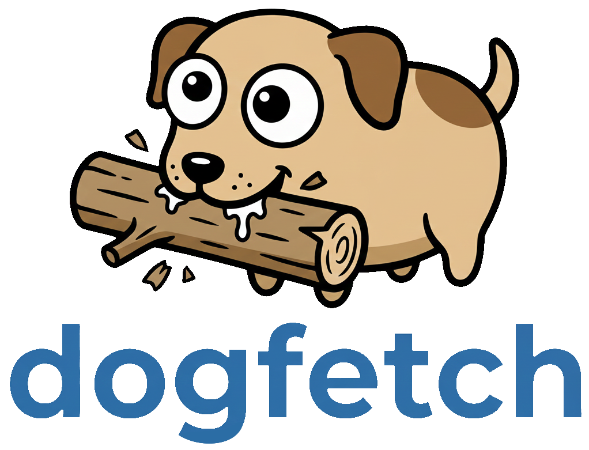

# dogfetch

Getting [Datadog logs](https://docs.datadoghq.com/logs/) to your machine is ruff. If you're a lazy mutt like 
me, use **dogfetch**. Woof!

## Quick start

```bash
export DD_API_KEY=your_api_key
export DD_APP_KEY=your_app_key

dogfetch --query 'service:web status:error' \
  --from '2024-01-01T00:00:00Z' \
  --to '2024-01-02T00:00:00Z' --format ndjson | jq -r '.attributes.message'
```

> [!IMPORTANT]
> **Breaking change:** when writing to **stdout**, the default output format is now
> [TOON](https://toonformat.dev) (a compact, agent-friendly tabular format) with a
> minimal field projection (`timestamp,status,service,message`). Pipelines that
> expect JSON lines on stdout should pass `--format ndjson` or set
> `DOGFETCH_FORMAT=ndjson`. File export with `--output` still defaults to lossless
> NDJSON — nothing changes there.

## Features

- **Simple query interface** - Fetch logs using Datadog's query syntax
- **Agent-friendly by default** - Compact TOON output with field projection on stdout (~70% smaller than raw JSON)
- **Pre-computed aggregates** - `dogfetch summary` for counts by status/service and a timeline, without fetching raw logs
- **Pattern clustering** - `dogfetch patterns` collapses thousands of repetitive logs into a handful of templates
- **Flexible output formats** - TOON, JSON, or NDJSON (newline-delimited JSON)
- **Memory efficient streaming** - NDJSON mode streams results to disk with minimal memory usage
- **Pagination checkpoint/resume** - Save progress and resume from where you left off if interrupted
- **Configurable time ranges** - Query logs from specific time windows
- **Cross-platform** - Works on Linux, macOS, and Windows

## Installation

### Claude Code plugin (recommended for agents)

```
/plugin marketplace add jtzemp/dogfetch
/plugin install dogfetch@dogfetch
```

This installs a skill that teaches Claude the agent-optimal call order
(`summary` → `patterns` → `fetch --limit`) and a wrapper script that
auto-downloads a sha256-verified binary from GitHub Releases on first use
(cached in `~/.cache/dogfetch/`). No manual binary install needed — only the
one-time Datadog key setup (run `dogfetch auth` or see
[Prerequisites](#prerequisites)).

### Pre-built binaries

Download the latest release for your platform from the [releases page](https://github.com/jtzemp/dogfetch/releases).

### Go install

```bash
go install github.com/jtzemp/dogfetch@latest
```

### Build from source

```bash
git clone https://github.com/jtzemp/dogfetch
cd dogfetch

make build
```

`make build` injects version info from git (tag, commit, build date) via
`-ldflags`, so `./dogfetch --version` reports something meaningful. A plain
`go build -o dogfetch` also works but skips that.

### Makefile targets

| Target             | What it does                                      |
|--------------------|---------------------------------------------------|
| `make build`       | Build `./dogfetch` with version info              |
| `make install`     | Build and install to `$GOPATH/bin`                |
| `make test`        | Run the test suite                                |
| `make test-cover`  | Run tests with coverage                           |
| `make lint`        | Run `golangci-lint` (matches CI)                  |
| `make build-all`   | Cross-compile for linux/darwin/windows            |
| `make version`     | Print the version/commit/date that would be built |
| `make dev`         | Quick build with no version info injected         |
| `make clean`       | Remove build artifacts                            |
| `make release-tag` | Update the version and create a tag for releasing |

```bash
# Check version
./dogfetch --version

# Build for all platforms
make build-all
```

## Prerequisites

You need a [Datadog API key and Application key](https://docs.datadoghq.com/account_management/api-app-keys/).
Set them as environment variables:

```bash
export DD_API_KEY=your_api_key
export DD_APP_KEY=your_app_key
```

Optionally, set your Datadog site if not using the default (datadoghq.com):

```bash
export DD_SITE=datadoghq.eu
```

## Usage

### Commands

| Command | What it does |
|---|---|
| `dogfetch fetch` | Fetch raw log lines (the default — `dogfetch --query …` is shorthand) |
| `dogfetch summary` | Counts by status/service + a timeline, via the Aggregate API (no raw logs) |
| `dogfetch patterns` | Cluster messages into templates so repetitive logs collapse to a few rows |
| `dogfetch auth` | Show credential status and setup help |
| `dogfetch version` | Print version information |
| `dogfetch` (no args) | Live home view: tool path, auth status, example commands |

For agents the cheap-to-expensive order is **`summary` → `patterns` → `fetch --limit`**.

### Basic Usage

```bash
# Fetch logs matching a query (compact TOON on stdout)
dogfetch --query 'service:web status:error'

# Pipe full JSON lines to a file
dogfetch --query 'service:web status:error' --format ndjson > logs.ndjson

# Or save directly to a file (defaults to lossless ndjson)
dogfetch --query 'service:web status:error' --output logs.ndjson

# Specify a custom time range
dogfetch --query 'service:api' --from '2024-01-01T00:00:00Z' --to '2024-01-02T00:00:00Z'

# Use JSON format and save to file
dogfetch --query 'service:database' --format json --output db-logs.json
```

### Summaries (no raw logs)

`dogfetch summary` answers "how many, what kind, when" with one fast call to
Datadog's Aggregate API — no pagination, no raw log payloads:

```bash
dogfetch summary --query 'service:web' --from 2h
```

```
total: 4523
by_status[3]{status,count}:
  error,3200
  warn,1000
  info,323
by_service[2]{service,count}:
  web,4000
  api,523
timeline[24]{time,count}:
  2026-06-11T10:00:00Z,2100
  ...
```

Group-bys show the top 25 by count (a help hint reports the full distinct
count when truncated). `--format json` emits the same data as a JSON object.

### Patterns (collapse repetitive logs)

`dogfetch patterns` clusters messages drain-style: volatile tokens (numbers,
hex ids, UUIDs, IPs, quoted values) become `<*>`, so a flood of similar logs
reads as a few templates with counts:

```bash
dogfetch patterns --query 'service:web status:error' --from 2h
```

```
scanned: 9421
patterns[3]{count,first_seen,last_seen,pattern}:
  8804,2026-06-11T08:01:12Z,2026-06-11T10:00:41Z,failed to process payment <*> for user <*> card_declined
  601,2026-06-11T08:00:03Z,2026-06-11T09:58:59Z,connection to <*> timed out after <*>
  16,2026-06-11T08:12:44Z,2026-06-11T09:40:02Z,schema migration completed successfully
```

Scans up to 10,000 logs by default (`--limit` to change), shows the top 50
patterns (`--top`), and `--samples` adds one raw example per pattern.

### Command Line Options (fetch)

```
--query string
    The filter query (search term). Single quote the entire query for best results.
    Example: --query 'service:web status:error'

--index string
    Which index to read from (default "main")

--limit int
    Stop after this many logs (0 = unlimited). Pairs with TOON output to
    keep agent context small; prints a resume cursor when more remain.

--from string
    Start date/time (default: 24 hours ago)
    Formats: RFC3339 (2024-01-01T00:00:00Z), Unix timestamp (1704067200)

--to string
    End date/time (default: current time)
    Formats: RFC3339 (2024-01-01T00:00:00Z), Unix timestamp (1704067200)

--pageSize int
    How many results to download at a time (default: 1000, max: 5000)

--output string
    Path of file to write results to (default: stdout)
    When not specified, logs are written to stdout and progress to stderr

--format string
    Output format: "toon", "json", or "ndjson"
    (default: "toon" on stdout, "ndjson" with --output)

    toon   - Compact tabular format with field projection, built for agents
    json   - Single JSON array, all data loaded into memory
    ndjson - Newline-delimited JSON, streams as it fetches (low memory)

--fields string
    Comma-separated fields to include in output
    (toon default: timestamp,status,service,message; any Datadog
    attribute path works, e.g. http.status_code)

--cursor string
    Page cursor position for resuming from a specific point
    Works with ndjson and toon (not json)

--append
    Append to output file instead of overwriting
    Only works with streamable formats (ndjson)

--errors-out string
    Write progress and error messages to file (default: stderr)
```

### Advanced Usage

#### Streaming Large Datasets

NDJSON (the default when writing to a file with `--output`) streams results as
they're fetched, minimizing memory usage:

```bash
dogfetch --query 'service:api' \
  --output large-export.ndjson \
  --pageSize 5000

# Or pipe directly to another tool (force ndjson — stdout defaults to TOON)
dogfetch --query 'service:api' --format ndjson | jq -r '.attributes.message'
```

#### Resume After Interruption

If a large fetch is interrupted, you can resume from where it left off. The cursor value is printed to stderr 
when the fetch stops:

```bash
# First attempt (gets interrupted)
dogfetch --query 'service:web' --output logs.ndjson
# stderr: Fetched 50000 logs... cursor: eyJhZnRlciI6eyJpZCI6IjEyMzQ1Njc4OTAiLCJ0aW1lc3RhbXAiOjE3MDQwNjcyMDB9fQ==
# (interrupted)

# Resume from cursor
dogfetch --query 'service:web' \
  --output logs.ndjson \
  --cursor 'eyJhZnRlciI6eyJpZCI6IjEyMzQ1Njc4OTAiLCJ0aW1lc3RhbXAiOjE3MDQwNjcyMDB9fQ==' \
  --append
```

**Why manual checkpointing?** The Datadog SDK provides automatic pagination helpers, but they don't expose 
the cursor or allow resuming from a specific point. By managing pagination manually, we can print the cursor
after each page and allow you to resume long-running fetches if they're interrupted by network issues, rate 
limits, or system shutdowns. This is particularly useful for large exports that may take hours.

#### Query Multiple Indexes

```bash
dogfetch --query 'status:error' --index 'retention-30' --output errors.ndjson
```

#### Redirect Errors to File

```bash
# Keep progress messages separate from output
dogfetch --query 'service:web' --errors-out progress.log > logs.ndjson
```

## Output Formats

### TOON (default on stdout)

A compact tabular format ([TOON](https://toonformat.dev)) with a default field
projection (`timestamp,status,service,message`). Built for agents — roughly 70%
smaller than the equivalent raw JSON. Read it directly; no parsing needed:

```
count: 2
logs[2]{timestamp,status,service,message}:
  2026-06-11T10:00:00Z,error,web,connection refused
  2026-06-11T10:00:01Z,warn,api,"timeout after 5s, retrying"
help[1]:
  Add fields with --fields timestamp,status,service,message,host (any Datadog attribute path works, e.g. http.status_code)
```

Widen columns with `--fields`. For lossless full objects, use `--format ndjson`
or `--format json` (or `--output`, which defaults to ndjson).

### NDJSON (default with `--output`)

Each log is a separate JSON object on its own line:

```json
{"id":"...","attributes":{"message":"...","timestamp":"..."}}
{"id":"...","attributes":{"message":"...","timestamp":"..."}}
```

This format:
- Uses minimal memory (logs are streamed as they're fetched)
- Can be processed line-by-line with standard tools
- Supports checkpoint/resume with `--cursor` and `--append`
- Works well with pipes and streaming tools

Process with standard tools:
```bash
# Count logs
wc -l logs.ndjson

# Filter with jq
jq 'select(.attributes.status == "error")' logs.ndjson

# Extract specific field
jq -r '.attributes.message' logs.ndjson

# Stream and process in real-time (force ndjson — stdout defaults to TOON)
dogfetch --query 'service:web' --format ndjson | jq -r '.attributes.message'
```

### JSON

Outputs a single JSON object with all logs in an array:

```json
{
  "logs": [
    {
      "id": "...",
      "attributes": {
        "message": "...",
        "timestamp": "...",
        ...
      }
    },
    ...
  ],
  "meta": {
    "total_fetched": 1523,
    "pages": 2
  }
}
```

This format buffers all logs in memory before writing. Use for smaller datasets or when you need the 
metadata wrapper.

## Architecture

### Design Goals

1. **Low memory footprint** - Stream data when possible instead of buffering everything
2. **Resilient** - Handle network failures, rate limits, and interruptions gracefully
3. **Fast** - Maximize page size and minimize unnecessary processing
4. **Simple** - Single binary, minimal configuration

### How It Works

```
┌─────────────────┐
│   CLI Parser    │  Parse args, validate config
└────────┬────────┘
         │
┌────────▼────────┐
│  Fetcher Loop   │  Paginate through results with cursor
│                 │  - Retry on transient errors
│                 │  - Print cursor for checkpointing
│                 │  - Handle rate limits
└────────┬────────┘
         │
┌────────▼────────┐
│ Writer Strategy │  JSON: buffer all, write once
│                 │  NDJSON: stream each page
└────────┬────────┘
         │
┌────────▼────────┐
│   Output File   │
└─────────────────┘
```

### Error Handling

- **Transient errors** (network timeouts, 5xx): Exponential backoff retry (3 attempts)
- **Rate limits** (429): Extended backoff based on Retry-After header
- **Permanent errors** (400, 401, 403): Fail immediately with clear message
- **Context cancellation** (Ctrl+C): Graceful shutdown, print current cursor (works on Windows, macOS, and Linux)

## Using with Claude Code

Install the plugin — it ships the skill and handles the binary automatically:

```
/plugin marketplace add jtzemp/dogfetch
/plugin install dogfetch@dogfetch
```

The bundled skill ([skills/dogfetch/SKILL.md](skills/dogfetch/SKILL.md))
teaches Claude Datadog query syntax and the token-cheap call order:
`summary` (counts, no raw logs) → `patterns` (collapse repetitive logs) →
`fetch --limit` (raw lines, projected fields). The wrapper script downloads
a sha256-verified release binary on first use and caches it.

The only manual step is Datadog credentials: put `DD_API_KEY` and
`DD_APP_KEY` in `~/.config/dogfetch/env` (chmod 600) or export them; run
`dogfetch auth` to check. Other agents can copy the same SKILL.md — it's
plain markdown over a plain CLI.

## Contributing

Contributions welcome! Please open an issue or PR.

## Releases

Releases are automated using GitHub Actions and GoReleaser. To create a new release:

1. **Bump the plugin version, commit, and tag — all in one step:**
   ```bash
   make release-tag V=0.2.0
   ```
   This updates `.claude-plugin/plugin.json` `version` to `0.2.0`, commits
   that change, and creates tag `v0.2.0` on top of it, so the version bump
   and the tag point at the same commit. Requires a clean working tree.

2. **Review, then push both:**
   ```bash
   git show
   git push origin HEAD
   git push origin v0.2.0
   ```

3. **GitHub Actions will automatically:**
   - Check the plugin version matches the tag and the wrapper script parses
   - Run all tests
   - Build binaries for Linux, macOS, and Windows (amd64 and arm64)
   - Create a GitHub release with:
     - Release notes from commits since last tag
     - Pre-built binaries
     - Checksums for verification (used by the plugin wrapper's sha256 check)

   The release workflow only *validates* the tagged commit. You tag it. Goreleaser builds it if it matches.

4. **Manual release (optional):**
   ```bash
   # Install goreleaser
   go install github.com/goreleaser/goreleaser@latest

   # Create a release locally
   goreleaser release --snapshot --clean
   ```

## License

MIT

## Acknowledgments

Built with the [Datadog Go API Client](https://github.com/DataDog/datadog-api-client-go).
